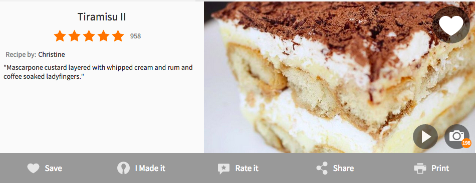

## What is functional programming?

λ

%

### Martin says:

<table>
<tr>
<td style="vertical-align:top;"></td>
<td style="font-size:18pt;padding:2pt;">

I think there are two different ways to talk about it.  One is negative and restrictive and the other is rather positive and inclusive.

So the negative and restrictive way is to say you want to program without any variables that change state during the execution of the program.

The positive thing is to say functional programming is programming that puts an emphasis on functions. Functions are first class values.

<a href="http://www.se-radio.net/2007/07/episode-62-martin-odersky-on-scala/">source</a> (Not his exact words, my summary)

</td>
</tr>
</table>

%

### What are functions?

    f(x) = x + x

    (+ 1 1)

    (print "hello, world")

%

%

%

<!-- A sequence of instructions within a larger computer program. Bit vague, but some interesting points -->

%

### What are functions?

* Collection of instructions for the computer
* The instructions are ordered
* The instructions have context

<!-- Going to try to go with an analogy: Recipes -->

%

%

%

### Recipes are functions!

* Collection of instructions for the cook
* The instructions are ordered
* The instructions have context

%

%

### Recipes are functions!

* Collection of instructions for the cook
* The instructions are ordered
* The instructions have context
* The instructions require input
* The instructions produce a result

<!--
this is where we start to hone in on the definition of functions in the context of functional programming
* collection of instructions for the computer
* they're ordered (sequence)
* they've context (the remaining computer program)
* they may have an input
* they always have an output

example:
input: onion, tomato, ...
instructions:
1. ee
output:

recipes sometimes reference another recipe

could interpret this as:
recipe takes another recipe as input and produces a recipe with a "nested" recipe

and that puts us half-way to our first-class functions:
and then the other half might come intuitively
-->
%

%

### Recipes are functions!

* Collection of instructions for the cook
* The instructions are ordered
* The instructions have context
* The instructions require input
* The instructions produce a result
* The recipe can take another recipe as input

%

### What are functions?

* Collection of instructions for the computer
* The instructions are ordered
* The instructions have context
* The instructions require input
* The instructions produce a result
* The function can take another function as input

%

### What does "functions as first class values" mean?

* Functions can take other functions as input
* Functions can produce other functions
* Or: The output of a function can be a function

%

### Martin says:

<table>
<tr>
<td style="vertical-align:top;"></td>
<td style="font-size:18pt;padding:2pt;">

I think there are two different ways to talk about it.  One is negative and restrictive and the other is rather positive and inclusive.

So the negative and restrictive way is to say you want to program without any variables that change state during the execution of the program.

The positive thing is to say functional programming is programming that puts an emphasis on functions. Functions are first class values.

<a href="http://www.se-radio.net/2007/07/episode-62-martin-odersky-on-scala/">source</a> (Not his exact words, my summary)

</td>
</tr>
</table>

<!--
So what does the first part, the restrictive part mean?

This is really about us being lazy.
It's really hard to understand something if it might change as you look at it.
-->

%

### No assignments?

    f(x) = x + x

%

### No assignments?

    f(x) = x + x

    x = 2
    f(2) = 2 + 2

%

### No assignments?

    f(x) = x + x

    x = 2
    f(x) = x + x

%

### No assignments?

    f(x) = x + x

    x = 2
    f(2) = x + x

%

### No assignments?

    f(x) = x + x

    x = 2
    f(2) = 2 + x

%

### No assignments?

    f(x) = x + x

    x = 2
    f(2) = 2 + ...

%

### No assignments?

    f(x) = x + x

    x = 2
    f(2) = 2 + ...
    x = 3

%

### No assignments?

    f(x) = x + x

    x = 2
    f(2) = 2 + 3
    x = 3

<!--

ooops.

Clojure helps you out by saying: Whenever you name a value, the value
associated with that name won't change.

Immutability, i.e., no mutable state.
-->

%

%

%

%

%

### Martin says:

<table>
<tr>
<td style="vertical-align:top;"></td>
<td style="font-size:18pt;padding:2pt;">

I think there are two different ways to talk about it.  One is negative and restrictive and the other is rather positive and inclusive.

So the negative and restrictive way is to say you want to program without any variables that change state during the execution of the program.

The positive thing is to say functional programming is programming that puts an emphasis on functions. Functions are first class values.

<a href="http://www.se-radio.net/2007/07/episode-62-martin-odersky-on-scala/">source</a> (Not his exact words, my summary)

</td>
</tr>
</table>

%

### Example

<textarea class="cljs-code">
(defn foreach [lst fun] (if (empty? lst) lst (cons (fun (first lst)) (foreach (rest lst) fun))))
(foreach [1 2 3] (fn [x] (+ x x)))
</textarea>

<textarea class="cljs-result"></textarea>

%

### References

More reading
* [Learn you a Haskell](http://learnyouahaskell.com/chapters)
* [Structure and Interpretation of Computer Programs](https://mitpress.mit.edu/sicp/)

Online courses:
* [Introduction to Functional Programming](https://www.edx.org/course/introduction-functional-programming-delftx-fp101x-0)
* [Functional Programming Principles in Scala](https://www.coursera.org/course/progfun)

Meetups in Auckland:
* [Auckland Clojure](http://www.meetup.com/Auckland-Clojure/)
* [Functional Programming](http://www.meetup.com/Functional-Programming-Auckland/)
* [Kiwi Code Retreat](http://www.meetup.com/kiwi-code-retreat)
* [NZ Scala](http://www.meetup.com/NZ-Scala)

Conference in Auckland:
* [Scala Down Under](http://scaladownunder.org/)

%

### Sources

* [http://lampwww.epfl.ch/~odersky/](http://lampwww.epfl.ch/~odersky/)
* [https://en.wikipedia.org/wiki/Function](https://en.wikipedia.org/wiki/Function)
* [http://allrecipes.com/recipe/21412/tiramisu-ii/](http://allrecipes.com/recipe/21412/tiramisu-ii/)
* [http://www.freelargeimages.com/grumpy-cat-no-5158/](http://www.freelargeimages.com/grumpy-cat-no-5158/)
* [http://scifi.stackexchange.com/questions/22955/how-did-the-bat-signal-work-on-cloudless-moonless-nights](http://scifi.stackexchange.com/questions/22955/how-did-the-bat-signal-work-on-cloudless-moonless-nights)
* [http://www.tomhickey.com/](http://www.tomhickey.com/)
* [http://www.thesaurus.com/browse/immutability](http://www.thesaurus.com/browse/immutability)

